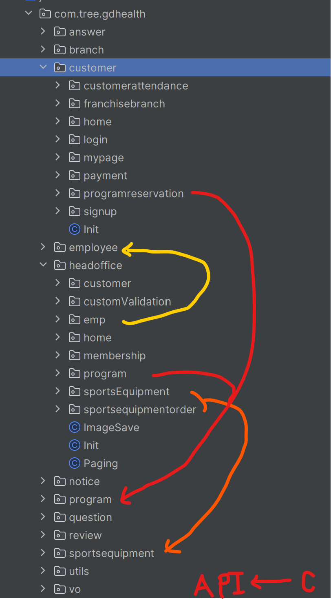

### 배포전 회의 ( 실행하지 못함 )
회의의 목적: 팀원의 프로젝트 코드 이해하기
- 1명씩 자신의 코드의 작동방식을 설명하기
- 다른사람은 리뷰해주기
- 마지막 차례대로 소고 나누기

### 패키지 구조

- 클라이언트와 API의 패키지가 혼재
- 중복된 영역을 다루는API가 발생 [EmpService.java] ,[EmployeeApiService.java] , [FranchiseBranchService.java] , [BranchApiService.java].
- 패키지 구조, 공통 API 대한 소통이 부족했다고 생각

### common API

- 로그인 세션관리는 통일된 클래스로 바꾸면 좋지 않았을까 생각
- 그 밖에 에러페이지처리, enum, 페이지네이션 등 공통으로 사용될 후보 API도 아쉬움
- 소통부족

### 표현과 도메인계층의 분리
- View에서 비지니스 로직보다는 해당 기능을 RestApi를 통해 도메인 서비스로 위임하기
- 관심사의 분리에 대한 논의가 부족

### 배포전 요청사항
- 배포전에 이미지와 계정정보, 등 샘플 데이터를 헬스클럽에 맞도록 변경 또한 샘플 데이터를 채우기, 고객, 직원, 프로그램, 예약, 발주, 물품 등
- 사용하지 않거나 개발이 덜된 페이지, 하이퍼링크, 기능은 삭제 , 테스트용 데이터나 링크는 삭제
- 최종적으로 완성된 웹 서비스처럼 보이도록 부탁드립니다.

- GitHub 사용하지 않은 브랜치, 이슈 삭제 

- 자신이 작성한 코드에 빠진 설명주석 추가
