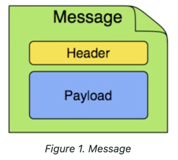
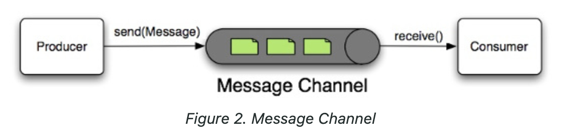

# Spring Integration

https://docs.spring.io/spring-integration/reference/

원문을 읽고 공부하고 요약하여 내 지식으로 만들기

### Overview of Spring Integration Framework

Spring Integration is motivated by the following goals:

- Provide a simple model for implementing complex enterprise integration solutions.
- Facilitate asynchronous, message-driven behavior within a Spring-based application.
- Promote intuitive, incremental adoption for existing Spring users.

Spring Integration is guided by the following principles:

- Components should be loosely coupled for modularity and testability.
- The framework should enforce separation of concerns between business logic and integration logic.
- Extension points should be abstract in nature (but within well-defined boundaries) to promote reuse and portability.

### Main Components

`Layered Architecture` and `Pipe-and-filters model` are not mutually exclusive.

#### Message

#### Message Channel

a message channel represents the `pipe` of `Pipe-and-filters model`.

in Spring Integration, pollable channels are capable of buffering Messages with a queue.

#### Message Endpoint
A Message Endpoint represents the “filter” of a pipes-and-filters architecture.

