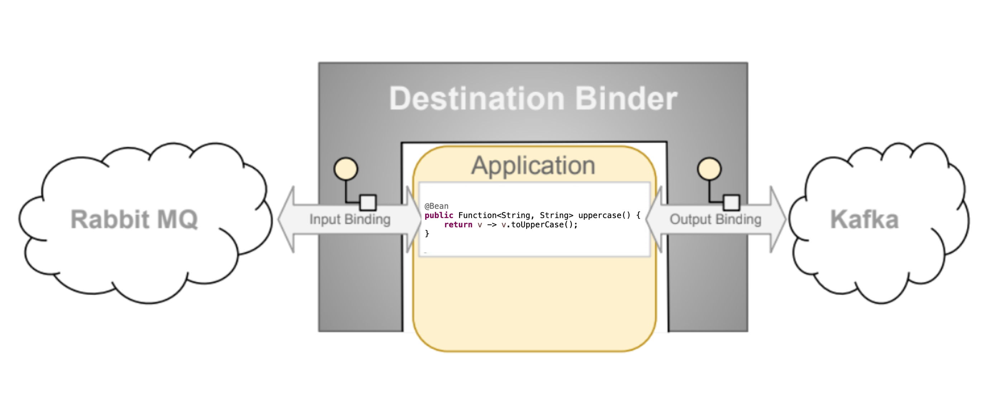

# Programming Model

To understand the programming model, you should be familiar with the following core concepts:

* **Destination Binders:** Components responsible to provide integration with the external messaging systems.
* **Bindings:** Bridge between the external messaging systems and application provided *Producers* and *Consumers* of messages (created by the Destination Binders).
* **Message:** The canonical data structure used by producers and consumers to communicate with Destination Binders (and thus other applications via external messaging systems).

