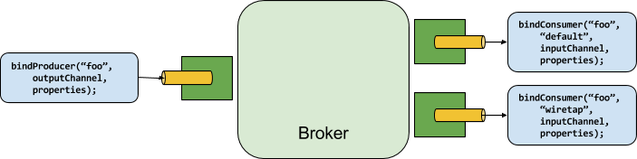

# Binder abstraction

Spring Cloud Stream provides a Binder abstraction for use in connecting to physical destinations at the external middleware.
This section provides information about the main concepts behind the Binder SPI, its main components, and implementation-specific details.

## Producers and Consumers

The following image shows the general relationship of producers and consumers:

Figure 1. Producers and Consumers

A producer is any component that sends messages to a binding destination.
The binding destination can be bound to an external message broker with a `Binder` implementation for that broker.
When invoking the `bindProducer()` method, the first parameter is the name of the destination within the broker, the second parameter is the instance if local destination to which the producer sends messages, and the third parameter contains properties (such as a partition key expression) to be used within the adapter that is created for that binding destination.

A consumer is any component that receives messages from the binding destination.
As with a producer, the consumer can be bound to an external message broker.
When invoking the `bindConsumer()` method, the first parameter is the destination name, and a second parameter provides the name of a logical group of consumers.
Each group that is represented by consumer bindings for a given destination receives a copy of each message that a producer sends to that destination (that is, it follows normal publish-subscribe semantics).
If there are multiple consumer instances bound with the same group name, then messages are load-balanced across those consumer instances so that each message sent by a producer is consumed by only a single consumer instance within each group (that is, it follows normal queueing semantics).

## Section Summary

* [A pluggable Binder SPI](overview-binder-api.html)
* [Binder Detection](binder-detection.html)
* [Multiple Binders on the Classpath](multiple-binders.html)
* [Connecting to Multiple Systems](multiple-systems.html)
* [Customizing binders in multi binder applications](binder-customizer.html)