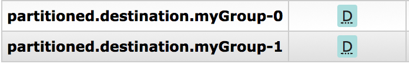
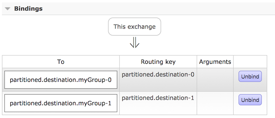

# Partitioning with the RabbitMQ Binder

RabbitMQ does not support partitioning natively.

Sometimes, it is advantageous to send data to specific partitions — for example, when you want to strictly order message processing, all messages for a particular customer should go to the same partition.

The `RabbitMessageChannelBinder` provides partitioning by binding a queue for each partition to the destination exchange.

The following Java and YAML examples show how to configure the producer:

Producer

```
@SpringBootApplication
public class RabbitPartitionProducerApplication {

    private static final Random RANDOM = new Random(System.currentTimeMillis());

    private static final String[] data = new String[] {
            "abc1", "def1", "qux1",
            "abc2", "def2", "qux2",
            "abc3", "def3", "qux3",
            "abc4", "def4", "qux4",
            };

    public static void main(String[] args) {
        new SpringApplicationBuilder(RabbitPartitionProducerApplication.class)
            .web(false)
            .run(args);
    }

    @Bean
    public Supplier<Message<?>> generate() {
        return () -> {
            String value = data[RANDOM.nextInt(data.length)];
            System.out.println("Sending: " + value);
            return MessageBuilder.withPayload(value)
                    .setHeader("partitionKey", value)
                    .build();
        };
    }

}
```

application.yml

```
    spring:
      cloud:
        stream:
          bindings:
            generate-out-0:
              destination: partitioned.destination
              producer:
                partitioned: true
                partition-key-expression: headers['partitionKey']
                partition-count: 2
                required-groups:
                - myGroup
```

|  |  |
| --- | --- |
|  | The configuration in the prececing example uses the default partitioning (`key.hashCode() % partitionCount`). This may or may not provide a suitably balanced algorithm, depending on the key values. You can override this default by using the `partitionSelectorExpression` or `partitionSelectorClass` properties.  The `required-groups` property is required only if you need the consumer queues to be provisioned when the producer is deployed. Otherwise, any messages sent to a partition are lost until the corresponding consumer is deployed. |

The following configuration provisions a topic exchange:


The following queues are bound to that exchange:



The following bindings associate the queues to the exchange:



The following Java and YAML examples continue the previous examples and show how to configure the consumer:

Consumer

```
@SpringBootApplication
public class RabbitPartitionConsumerApplication {

    public static void main(String[] args) {
        new SpringApplicationBuilder(RabbitPartitionConsumerApplication.class)
            .web(false)
            .run(args);
    }

    @Bean
    public Consumer<Message<String>> listen() {
        return message -> {
            String queue =- message.getHeaders().get(AmqpHeaders.CONSUMER_QUEUE);
            System.out.println(in + " received from queue " + queue);
        };
    }

}
```

application.yml

```
    spring:
      cloud:
        stream:
          bindings:
            listen-in-0:
              destination: partitioned.destination
              group: myGroup
              consumer:
                partitioned: true
                instance-index: 0
```

|  |  |
| --- | --- |
|  | The `RabbitMessageChannelBinder` does not support dynamic scaling. There must be at least one consumer per partition. The consumer’s `instanceIndex` is used to indicate which partition is consumed. Platforms such as Cloud Foundry can have only one instance with an `instanceIndex`. |