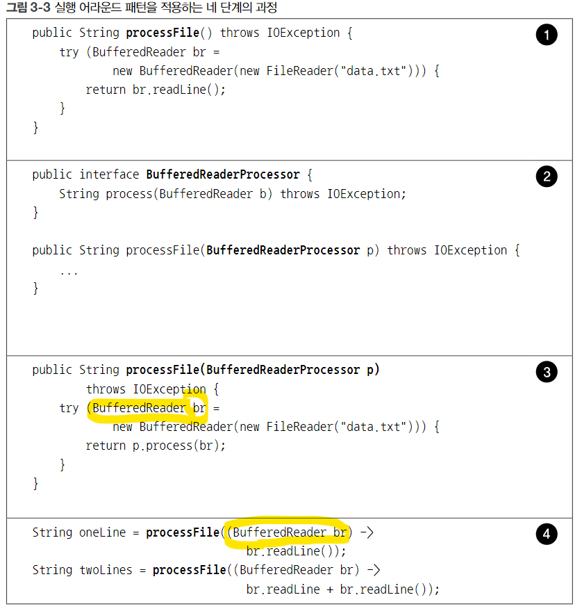

# 모던자바인액션
## 1 자바의 변화
### 1.1 역사의 흐름
sort 알고리즘 비교하기
```java
// java 8 이전의 sort
import java.util.*;

public class Main {

    public static void main(String[] args) {
        Person p1 = new Person(1); // field int age에 숫자가 입력됨
        Person p2 = new Person(2);
        Person p3 = new Person(3);

        ArrayList<Person> personList = new ArrayList<>();
        personList.add(p3); 
        personList.add(p2);
        personList.add(p1); // 역순으로 리스트를 만듬 {3,2,1}

        Collections.sort(personList, new Comparator<Person>() {
            @Override
            public int compare(Person o1, Person o2) {
                return o1.age - o2.age;
            }
        });
        /** Collections collection 을 다루는 유틸리티 클래스이며 
         * .sort method를 static으로 갖고 있다.
         * parameters로 1. 다룰 list, 2. 정렬에쓰일 Comparator 상속 객체가 입력된다.
         * .sort는 Comparator 상속 객체의 compare method로 정렬을 수행한다.
         * 외부에서 만들어서 입력이 가능하고 예제처럼 new연산자를 그대로 익명객체로 구현하면
         * 간편하게 정렬에 사용할 수 있다. 
         * Comparator 상속 객체의 return value가 음수인 경우 parameters로 입력된
         * o1, o2의 자리를 바꾼다. 최종적으로 모두 양수가 나올 때까지 정렬을 수행한다.
         * Descending sort의 경우 o2.age - o1.age와 같이 할 수 있다.
         * 만약 Person이 Comparable을 implement 했다면 
         * Collections.sort(personList); 로 정렬이 가능하다.
         */

        for (Person person : personList) {
            System.out.println(person.age);
        }
        /**결과
         * 1
         * 2
         * 3
         * */
    }
}
```
- 자바 8 함수형프로그래밍의 핵심
  - 기존에 전달이 불가능했던 2급 객체인 메소드와 함수를 1급객체화 시킴

### 2 동작파라미터화 코드 전달 sever behavior parameterization code
빈번하게 바뀌는 필터링 메소드의 필터링로직을 외부에서 구현해주게끔 만들면 코드가 유연해진다. 이때 필터메소드가 외부 메소드를 호출 하는 것이 아니다. 필터메소드가 호출 될 때 필터링로직을 내장한 객체를 인자로 전달해주면 바로 사용할 수 있다. 

전략패턴

.. 아마도 함수형 프로그래밍을 내가 설명글을 쓰기보다 실제 프로젝트에 적용해보는 편이 좋을 듯하다.
단계 1 외부 함수형인터페이스를 구현해서 인자로 가져오기
단계 2 호출시 인자에 익명클래스로 구현해서 쓰기
단계 3 호출시 인자에 람다식을 적용해서 쓰기



그림처럼 외부에서 메소드1에 람다식을 전달할 때 메소드1이 생성하고 관리하고 있는 자원을 타입과 식별자로 전달하는 것으로 사용할 수 있다.

